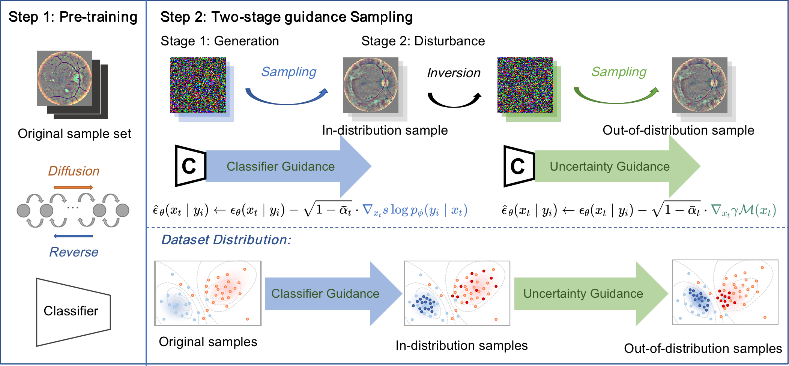

  <h2>🦄️ Measurement Guidance in Diffusion Models: Insight from Medical Image Synthesis (TPAMI 2024) </h2>

<div>
    <a href='https://scholar.google.com.hk/citations?user=InHF3ykAAAAJ&hl=zh-CN' target='_blank'>Yinmin Luo</a> <sup>*,#</sup> &nbsp;
    <a href='https://github.com/yangqy1110' target='_blank'>Qinyu Yang</a><sup>*</sup> &nbsp;
    <a href='https://github.com/yangqy1110/MGDM' target='_blank'>Yuheng Fan</a> &nbsp;
    <a href='https://scholar.google.com.hk/citations?user=AWI7KUsAAAAJ&hl=zh-CN' target='_blank'>Haikun Qi</a> &nbsp;
    <a href='https://menghanxia.github.io/' target='_blank'>Menghan Xia</a> &nbsp;
</div>
<div>
    <sup>*</sup>First Author, &nbsp; <sup>#</sup> Corresponding Author. &nbsp;
  
</div>

## Introduction
In this work, we first conducted an analysis on previous guidance as well as its contributions on further applications from the perspective of data distribution. To synthesize samples which can help downstream applications, we then introduce uncertainty guidance in each sampling step and design an uncertainty-guided diffusion models.

<p align="center">
  
</p>

Furthermore, we provide a theoretical guarantee for general gradient guidance in diffusion models, which would benefit future research on investigating other forms of measurement guidance for specific generative tasks.

## 🕹️ Code and Environment

#### 1. Clone the Repository

```
git clone https://github.com/yangqy1110/MGDM.git
cd ./MGDM/scripts
```

#### 2. Environment Setup

First configure the environment according to [guided-diffusion](https://github.com/openai/guided-diffusion) and [improved-diffusion](https://github.com/openai/improved-diffusion).
```
# Finally:
pip install blofile
conda install mpi4py
pip install torchsampler
```

#### 3. Training Data

Training data should be saved in the following form:
```
|--dataset
  |--0
    |----0_001.png
    |----0_002.png
    |----0_003.png
    |----...
  |--1
    |----1_001.png
    |----1_002.png
    |----1_003.png
    |----...
  |--2
    |----2_001.png
    |----2_002.png
    |----2_003.png
    |----...
  |--...
```

## 💫 Step 1: Pre-training

#### 1. Diffusion Model

```Python
(CUDA_VISIBLE_DEVICES=$device )python image_train.py --single_gpu True # specific single gpu(default is 0)
mpiexec -n $gpu_num python image_train.py                              # multi-gpu parallel
```

```
--data_dir              # Path to training data.
--schedule_sampler      # Default is "uniform".
--lr                    # learning rate, default is 1e-4.
--weight_decay          # Default is 0.00001.
--lr_anneal_steps       # Total training steps. The default value is False, which means unlimited.
--batch_size            # Default is 1.
--microbatch            # Default is -1, disables microbatches.
--ema_rate              # Default is "0.9999",  # comma-separated list of EMA values.
--log_interval          # How many steps to print a log? default is 10.
--save_interval         # How many steps to save a checkpoint? default is 10000.
--resume_checkpoint     # Initial model weight pth file path, default is "".
--use_fp16              # Default is False.
--fp16_scale_growth     # Default is 1e-3.
--log_root              # FolderPath of log and checkpoint "../logs".
--imablancedsample      # Whether to use torchsampler.ImbalancedDatasetSampler. The default value is False. 
                        # Not available when using multiple GPUs. Default is True.
--random_flip           # Whether to use np.fliplr.
--single_gpu            # Whether to specify a single GPU. The default value is False.
--image_size            # size of image. Default is 128.
--in_channels           # The number of channels entered into the network. Default is 3.
--num_classes           # Several classification questions. Default is 2.
--prob_uncon            # Probability of classless embedding in training. Default is 0.
```

Other hyperparameters can be found in `def diffusion_defaults()` and `def model_and_diffusion_defaults()` in `guided_diffusion/script_util.py`.

#### 2. Classifier Model

```Python
(CUDA_VISIBLE_DEVICES=$device )python classifier_train.py --single_gpu True # specific single gpu(default is 0)
mpiexec -n $gpu_num python classifier_train.py                              # multi-gpu parallel
```

```
--data_dir           # Path to training data.
--val_data_dir       # Path to val data.
--noised             # Whether to add noise, default is True.
--iterations         # Total training steps. default is 200001.
--lr                 # learning rate, default is 3e-4.
--weight_decay       # Default is 0.00001.
--batch_size         # Default is 1.
--microbatch         # Default is -1, disables microbatches.
--schedule_sampler   # Default is "uniform".
--resume_checkpoint  # resume train
--log_interval       # How many steps to print a log? Default is 50.
--eval_interval      # How many steps to eval? Default is 50.
--save_interval      # How many steps to save a checkpoint? Default is 10000.
--log_root           # FolderPath of log and checkpoint". Default is "../logs_clas".
--single_gpu         # Whether to specify a single GPU. The default value is False.
--imablancedsample   # Whether to use torchsampler.ImbalancedDatasetSampler. The default value is False. 
                     # Not available when using multiple GPUs. Default is True.
--model_path         # Initial model weight pth file path, default is "".
--single_gpu         # Whether to specify a single GPU. The default value is False.
--image_size         # size of image. Default is 128.
--in_channels        # The number of channels entered into the network. Default is 3.
--num_classes        # Several classification questions. Default is 2.
```

Other hyperparameters can be found in `def diffusion_defaults()` and `classifier_defaults()` in `guided_diffusion/script_util.py`.

## 🏞️ Step 2: Two-stage guidance Sampling

#### Stage 1. Generation
```Python
(CUDA_VISIBLE_DEVICES=$device )python classifier_or_cfg_sample.py --single_gpu True # specific single gpu(default is 0)
```

```
--num_classes           # Several classification questions. Default is 2.
```

Other hyperparameters can be found in `config/global_settings.py`.

#### Stage 2. Disturbance
```Python
(CUDA_VISIBLE_DEVICES=$device )python dual_bridge_sample.py --single_gpu True # specific single gpu(default is 0)
```

```
--num_classes           # Several classification questions. Default is 2.
```

Other hyperparameters can be found in `config/global_settings.py`.

## Citation
```
@article{luo2024measurement,
  title={Measurement Guidance in Diffusion Models: Insight from Medical Image Synthesis},
  author={Luo, Yimin and Yang, Qinyu and Fan, Yuheng and Qi, Haikun and Xia, Menghan},
  journal={IEEE Transactions on Pattern Analysis and Machine Intelligence},
  year={2024},
  publisher={IEEE}
}
```

## Acknowledgements

We sincerely appreciate the code release of the following projects: [guided-diffusion](https://github.com/openai/guided-diffusion), [improved-diffusion](https://github.com/openai/improved-diffusion) and [ddib](https://github.com/suxuann/ddib).
